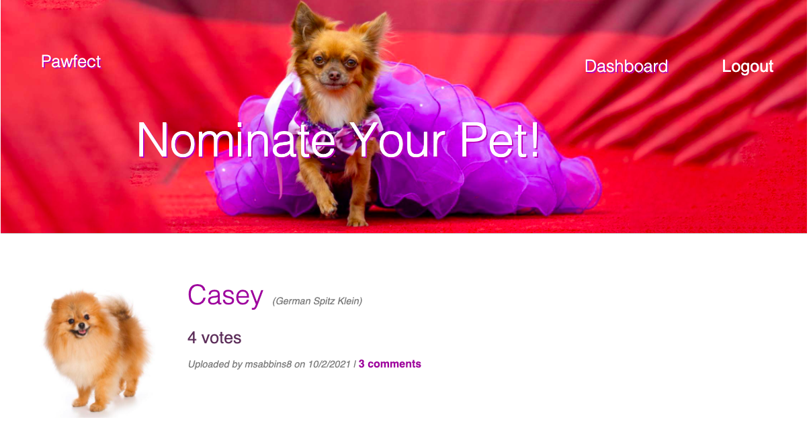
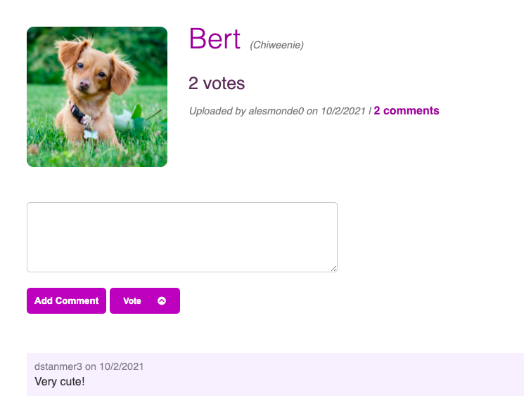
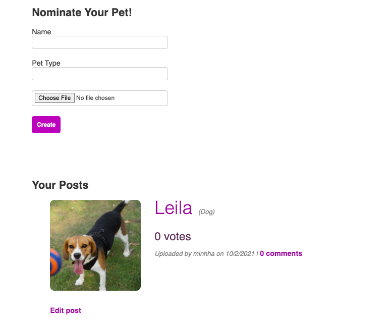

# Pawfect: Pet Hot or Not

This app is a virtual pet beauty pageant, a hot-or-not site for pets. Users can post, comment and vote on pet pictures. 
* Users upload a picture, name, and type of their pet.
* Users can login in to comment and vote on pets.
* When logged in, users can access the Dashboard to edit or delete their posts.
* The app is both mobile and desktop friendly.
 

## Technologies
* Using Node.js and Express.js to create RESTful APIs.
* Using Handlebars.js as the templating engine.
* Using MySQL and the Sequelize ORM for the database.
* Deployed using Heroku and JawsDB (with data).
* Using Cloundinary and Multer to post and store images in the database.
* Using Jest testing framework.
* Using Model - View - Controller architecture
* Including authentication (express-session and cookies).
* Protecting API keys and sensitive information using Dotenv.
* Built with CSS, Javascript, and HTML
 

## Screenshots
Homepage

    </img>

 
Comment or Vote

    </img>

 
Dashboard

    </img>

 

## Deployed Link
https://minhha-pawfect-pet.herokuapp.com/

 

## GitHub Repo
https://github.com/minhhap/Pawfect-Pet-Hot-Or-Not

